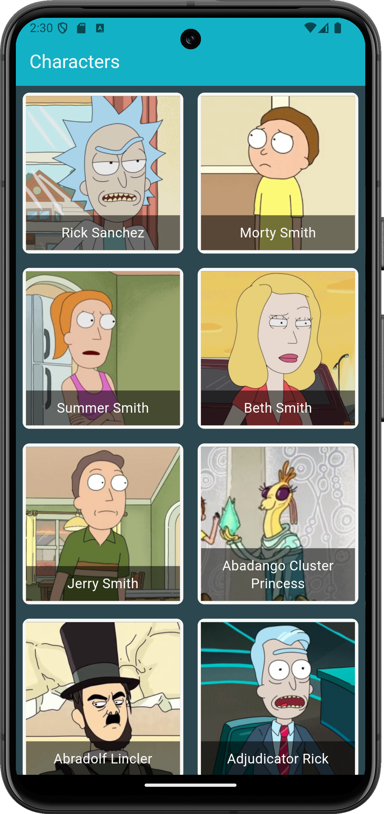
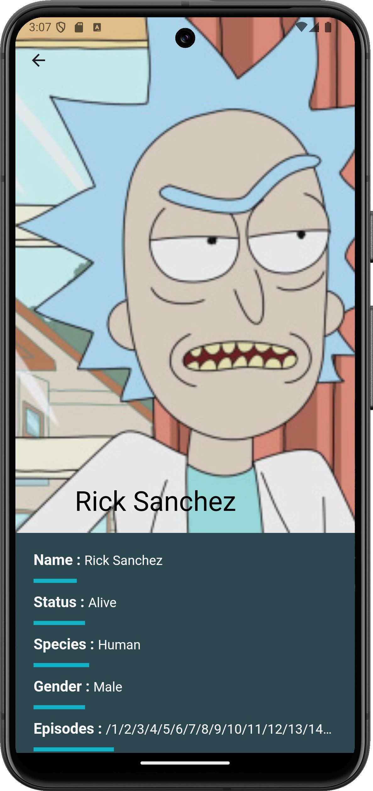
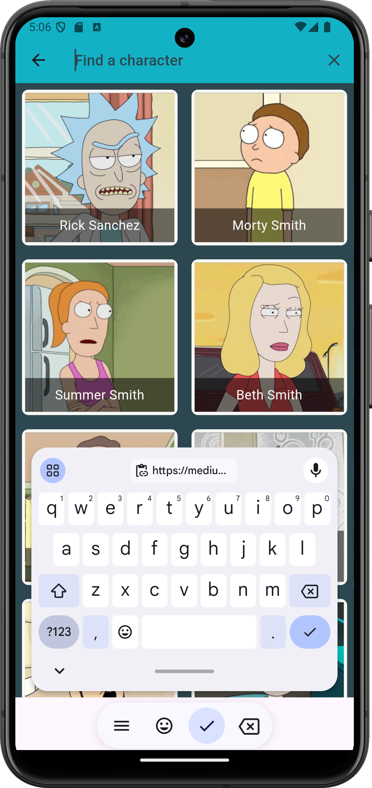
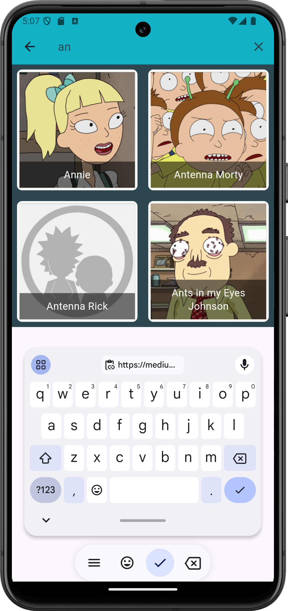

# blocapp: Rick&Morty Characters App.
This app is on my journey to learn flutter and especially Bloc And Cubit.
I applied What I learn in Eng/Omar Ahmed [Flutter BLoC arabic](https://youtube.com/playlist?list=PLwWuxCLlF_ufA0GYYjlx_R4smekKH_AuB&si=5a36y9uL6v4X-i9I) course 

## Demo

## Color Reference

| Color | Hex                                                                |
|-------| ------------------------------------------------------------------ |
| Green |  #13b1c6 |
| Blue  |  #2c474f |
| White |  #f7f7f5 |

## Screenshots
**Home Page:** 

**Details Page:**

**Search Page:**

## 🔗 Links

## Acknowledgements

- [Eng Omar Ahmed Channel](https://www.youtube.com/@OmarAhmedx14)
- [Bloc course](https://youtube.com/playlist?list=PLwWuxCLlF_ufA0GYYjlx_R4smekKH_AuB&si=GCKux4tXcOuRoMvl)
"# Rick-Morty-Flutter-App" 
